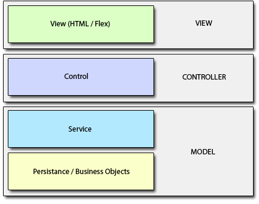
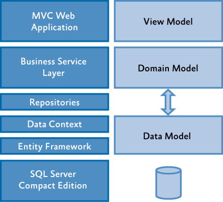
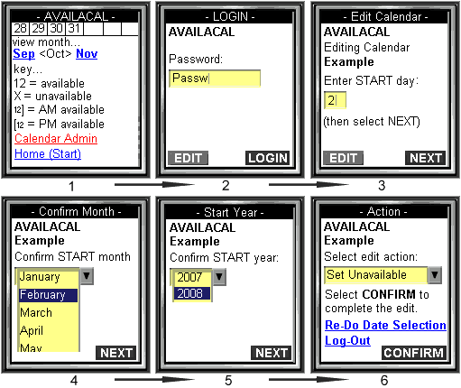
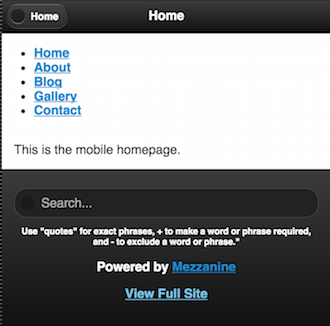
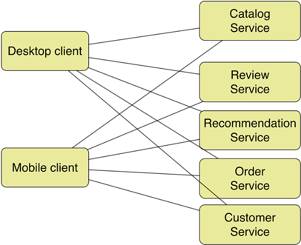

#引言

回到一年前的今天(2014.09.29)，一边在准备着去沙漠之旅，一边在准备国庆后的印度培训。

当时我还在用我的Lumia 920，上面没有各式各样的软件，除了我最需要的地图、相机。所以，我需要为我的手机写一个应用，用于在地图上显示图片信息及照片。

今天Github已经可以支持geojson了，于是你可以看到我在之前生成的geojson在地图上的效果[gps.geojson](https://github.com/phodal-archive/onmap/blob/master/gps.geojson)。

##Re-Practise

在过去的近一年时期里，花费了很多时间在提高代码质量与构建架构知识。试着学习某一方面的架构知识，应用到某个熟悉领域。

1. 所谓的一万小时天才理论一直在说明练习的重要性，你需要不断地去练习。但是并不是说你练习了一万小时之后就可以让你成为一个专家，而练习是必须的。

2. 让我想起了在大学时代学的PID算法，虽然我没有掌握好控制领域的相关理论及算法，但是我对各种调节还算有点印象。简单地来说，我们需要不断调整自己的方向。

现在还存在的那些互联网公司或者说开源项目，我们会发现两个不算有趣的规律：

1. 一个一直在运行的软件。
2. 尝试了几个产品，最后找到了一个合适的方向。

我发现我属于不断尝试地类型。一直想构建一个开源软件，但是似乎一直没有找对合理的用户？但是，我们会发现上述地两者都在不断地retry，不断地retry归根于那些人在不断的repractise。与之成为反例的便是：

1. 一个成功发布几次的软件，但是最后失败了
2. 尝试了不同的几个产品，但是失败了

所谓的失败，就是你离开人世了。所以，在我们还活着的时候，我们总会有机会去尝试。在那之前，我们都是在不断地re-practise。

这让我想到了Linux，这算是一个不错地软件，从一开始就存活到了现在。但是有多少开源软件就没有这么幸运，时间在淘汰越来越多的过去想法。人们创造事物的能力也越来越强，但是那只是因为创造变得越来越简单。

在我们看到的那些走上人生巅峰的CEO，还都在不断地re-practise。

##技术与业务

于是，我又再次回到了这样一个现实的问题。技术可以不断地练习，不断地调整方向。但是技术地成本在不断地降低，代码的长度在不断地降低。整个技术的门槛越来越低，新出现的技术总会让新生代的程序员获利。但是不可避免地，业务地复杂度并没有因此而降低。这就是一个复杂的话题，难道业务真的很复杂吗？

人们总会提及写好CSS很难，但是写好Java就是一件容易的事。因为每天我们都在用Java、JavaScript去写代码，但是我们并没有花费时间去学。

因为我们一直将我们的时候花费的所谓的业务上，我们可以不断地将一些重复的代码抽象成一个库。但是我们并没有花费过多的时间去整理我们的业务，作为程序员，我们切换工作很容易只是因为相同的技术栈。作为一些营销人员，他们从一个领域到一个新的领域，不需要过多的学习，因为本身是相通的。

技术本身是如此，业务本身也是如此。

从技术到业务是一条难走通的路？

##资讯爆炸

回顾到最近出现的各种资讯程序——开发者头条、极客头条、掘金、博乐头条等等，他们帮助我们的是丰富我们的信息，而不是简化我们的信息。

作为一个开发人员，过去我们并不需要关注那么多的内容。如果我们没有关注那么多的点，那么我们就可以集中于我们的想法里。实现上，我们需要的是一个更智能的时代。

业务本身是一种重复，技术本身也是重复的。只是在某个特定的时刻，一个好的技术可以帮助我们更好地Re-Practise。如推荐算法本身依赖于人为对信息进行分类，但是我们需要去区分大量地信息。而人本身的经历是足够有险的，这时候就需要机器来帮我们做很多事。

##结

今天我在用MX5，但是发现不及Lumia 1020来得安静。功能越强大的同时，意味着我在上面花费的时间会更多。事情有好的一面总会有不好的一面，不好的一面也就意味着有机会寻找好的一面。

我们需要摒弃一些东西，以重新纠正我们的方向。于是，我需要再次回到Lumia 1020上。

#Lost

> 一开始就输在起跑线上

> 输了，才需要加倍努力

#介绍

#前端

###什么是前端？

维基百科是这样说的：前端Front-end和后端back-end是描述进程开始和结束的通用词汇。前端作用于采集输入信息，后端进行处理。计算机程序的界面样式，视觉呈现属于前端。

这种的说法给人一种很模糊的感觉，但是他说得又很对，它负责视觉展示。在MVC结构或者MVP中，负责视觉显示的部分只有View层，而今天大多数所谓的View层已经超越了View层。View层是一个很神奇的概念，但是而今的View层已经发现了很大的变化。

你引入了React、Backbone、Angluar，你的架构变成了MVVM、MVP、MVC。尽管发生了一些架构上的变化，但是项目的开发并没有因此而发生变化。这其中涉及到了一些职责的问题，如果某一个层级中有太多的职责，那么它是不是加重了一些人的负担。

##前端发展的历史

过去一直想整理一篇文章来说说前端发展的历史，但是想了想这些历史已经被人们所熟知。后来发现并非如此，只是因为关注的一些人都是有历史的，后来发现事情并非如此。

###数据-模板-样式混合

在有限的前端经验里，我还是经历了那段用Table来作样式的年代。大学期间曾经有偿帮一些公司或者个人维护、开发一些CMS，而Table是当时帮某个网站更新样式接触到的——ASP.Net（maybe)。当时，我们启动这个CMS，用的是一个名为``aspweb.exe``的程序。于是，在我的移动硬盘里找到了下面的代码。

```html
<TABLE cellSpacing=0 cellPadding=0 width=910 align=center border=0>
  <TBODY>
  <TR>
    <TD vAlign=top width=188><TABLE cellSpacing=0 cellPadding=0 width=184 align=center border=0>
        <TBODY>
        <TR>
          <TD></TD></TR>
        <TR>
          <TD>
            <TABLE cellSpacing=0 cellPadding=0 width=184 align=center 
            background=Images/xxx.gif border=0>
```            

虽然，我也已经在HEAD里找到了现代的雏形——DIV + CSS，而这还是一个Table的年代。

```html
<LINK href="img/xxx.css" type=text/css rel=stylesheet>
```

**人们一直在说前端很难，问题是你学过么！！！**也许，你也一直在说CSS不好写，但是CSS真的不好写么？人们总在说JS很难用，但是你学过么？只在用的时候才去学，那肯定很难。**你不曾花时间去学习一门语言，但是却能直接写出可以work的代码，正是在说明他们容易上手么？**如果你看过一些有经验的Ruby、Scala、Emacs Lisp开发者写出来的代码，我想会得到相同的结论。有一些语言可以使写程序的人Happy，但是看的人可能就不会Happy。做事的方法不止一种，但是不是所有的人都要用那种方法去做。

过去的那些程序员都是**真正的全栈程序员**，这些程序员不仅仅做了前端的活，然后还有数据库的工作。

```asp
Set rs = Server.CreateObject("ADODB.Recordset")
sql = "select id,title,username,email,qq,adddate,content,Re_content,home,face,sex from Fl_Book where ispassed=1 order by id desc"
rs.open sql, Conn, 1, 1
fl.SqlQueryNum = fl.SqlQueryNum + 1
```

在这个ASP文件里，它从数据库里查找出了数据，然后Render出HTML。如果可以看到版本的历史，那么我想我会看到有一个作者将style=""的代码一个个放到css文件中。

在这里的代码里也免不了有动态生成JavaScript代码的方法：

```asp
show_other = "<SCRIPT language=javascript>"
show_other = show_other & "function checkform()"
show_other = show_other & "{"
show_other = show_other & "if (document.add.title.value=='')"
show_other = show_other & "{"
```

请尽情嘲笑，然后再看段代码：

```javascript
import React from "react";
import { getData } from "../../common/request";
import styles from "./style.css";


export default class HomePage extends React.Component {
  componentWillMount() {
    console.log("[HomePage] will mount with server response: ", this.props.data.home);
  }

  render() {
    let { title } = this.props.data.home;

    return (
      <div className={styles.content}>
        <h1>{title}</h1>
        <p className={styles.welcomeText}>Thanks for joining!</p>
      </div>
    );
  }

  static fetchData = function(params) {
    return getData("/home");
  }
}
```

10年前和10年后的代码，似乎没有太多的变化。有所不同的是数据层已经被独立出去了，如果你的component也混合了数据层，即直接查询数据库而不是调用数据层接口，那么你就需要好好思考下这个问题。你只是在追随潮流，还是在改变。用一个View层更换一个View层，用一个Router换一个Router的意义在哪？

###Model-View-Controller

人们在不断地反思这其中复杂的过程，整理了一些好的架构模式，其中不得不提到的是我司Martin Folwer的《企业应用架构模式》。这本书译版出版的时候是2004年，那时对于系统的分层是

层次	   | 职责
-------| -----
表现层  | 	提供服务、显示信息、用户请求、HTTP请求和命令行调用。
领域层  | 	逻辑处理，系统中真正的核心。
数据层  | 	与数据库、消息系统、事物管理器和其他软件包通讯。

化身于当时最流行的Spring，就是MVC。人们有了iBatis这样的数据持久层框架，即ORM，对象关系映射。于是，你的package就会有这样的几个文件夹：

```
|____mappers
|____model
|____service
|____utils
|____controller
```

在mappers这一层，我们所做的莫过于如下所示的数据库相关查询：

```java
@Insert(
        "INSERT INTO users(username, password, enabled) " +
                "VALUES (#{userName}, #{passwordHash}, #{enabled})"
)
@Options(keyProperty = "id", keyColumn = "id", useGeneratedKeys = true)
void insert(User user);
```    

model文件夹和mappers文件夹都是数据层的一部分，只是两者间的职责不同，如：

```java
public String getUserName() {
    return userName;
}

public void setUserName(String userName) {
    this.userName = userName;
}
```

而他们最后都需要在Controller，又或者称为ModelAndView中处理：

```java
@RequestMapping(value = {"/disableUser"}, method = RequestMethod.POST)
public ModelAndView processUserDisable(HttpServletRequest request, ModelMap model) {
    String userName = request.getParameter("userName");
    User user = userService.getByUsername(userName);
    userService.disable(user);
    Map<String,User> map = new HashMap<String,User>();
    Map <User,String> usersWithRoles= userService.getAllUsersWithRole();
    model.put("usersWithRoles",usersWithRoles);
    return new ModelAndView("redirect:users",map);
}
```

在多数时候，Controller不应该直接与数据层的一部分，而将业务逻辑放在Controller层又是一种错误，这时就会有Service层。就有了下图：


然而，人们对于Domain相关的Service应该放在哪一层都有不同意见：




Domain（业务）是一个相当复杂的层级，这里是业务的核心。一个合理的Controller只应该做自己应该做的事，它不应该处理业务相关的代码：

```java
if (isNewnameEmpty == false && newuser == null){
    user.setUserName(newUsername);
    List<Post> myPosts = postService.findMainPostByAuthorNameSortedByCreateTime(principal.getName());

    for (int k = 0;k < myPosts.size();k++){
        Post post = myPosts.get(k);
        post.setAuthorName(newUsername);
        postService.save(post);
    }
    userService.update(user);
    Authentication oldAuthentication = SecurityContextHolder.getContext().getAuthentication();
    Authentication authentication = null;
    if(oldAuthentication == null){
        authentication = new UsernamePasswordAuthenticationToken(newUsername,user.getPasswordHash());
    }else{
        authentication = new UsernamePasswordAuthenticationToken(newUsername,user.getPasswordHash(),oldAuthentication.getAuthorities());
    }
    SecurityContextHolder.getContext().setAuthentication(authentication);
    map.clear();
    map.put("user",user);
    model.addAttribute("myPosts", myPosts);
    model.addAttribute("namesuccess", "User Profile updated successfully");
    return new ModelAndView("user/profile", map);
}
```

我们在Controller层应该做的事是：

1. 处理请求的参数
2. 渲染和重定向
3. 选择Model和Service
4. 处理Session和Cookies

业务是善变的，昨天我们可能还和对手竞争谁先推出新功能，但是今天可能已经合并了。我们很难预见业务变化，但是我们应该能预见Controller不容易变。在一些设计里面，这部分可能就会变成Command模式来处理。

View层是一直在变化的层级，人们的品味一直在更新，有时甚至可能因为竞争对手而产生变化。在已经取得一定市场的情况下，Model-Service-Controller通常都不太会变动，甚至不敢变动。企业意识到创新两面的，要么带来死亡，要么占领多一点的市场。但是对手通常都比你想象中的要聪明，所以开创新的业务是一个更好的选择。

在高速发展期的企业比发展初期的企业比，更需要前端开发人员。在用户基数不够、业务待定的情形中，View只要可用并美观就行了。这时，可能就会有大量的业务代码放在View层：

```jsp
<c:choose>
    <c:when test="${ hasError }">
    <p class="prompt-error">
        ${errors.username} ${errors.password}
    </p>
    </c:when>
    <c:otherwise>
    <p class="prompt">
        Woohoo, User <span class="username">${user.userName}</span> has been created successfully!
    </p>
    </c:otherwise>
</c:choose>	
```

不同的情形下，人们都会对此有争议，但是符合当前的业务便是最好的选择。然后作为一个前端开发人员，我在过去需要修改JSP、PHP文件，但是我需要去了解这些Template，

```php
{foreach $lists as $v}
<li itemprop="breadcrumb"><span{if(newest($v['addtime'],24))} style="color:red"{/if}>[{fun date('Y-m-d',$v['addtime'])}]</span><a href="{$v['url']}" style="{$v['style']}" target="_blank">{$v['title']}</a></li>
{/foreach}
```       

所以，有时像Django这一类，自称为Model-Template-View的框架，更容易让人理解其意图：

```


<section class="section--center mdl-grid mdl-grid--no-spacing mdl-shadow--2dp mdl-cell--11-col blog-list">

<div class="mdl-card__title mdl-card--border mdl-card--expand">
    <h2 class="mdl-card__title-text">
        <a href="{{ blog_post.get_absolute_url }}"  itemprop="headline">{{ blog_post.title }} › </a>
    </h2>
</div>


```

作为一个前端人员，我们真正在接触的是View层和Template层，但是MVC并没有说明这些。

###从桌面版到移动版

Wap是的出现，带来了更多的挑战。分辨率从1024x768变成了176×208，开发人员不得不面向这些挑战。当时所需要做的仅仅修改View层，而View层随着iPhone又发现了变化。



这是一个短暂的历史，人们并不知道他们需要为手机用户制作这样的一个网站，于是他们把桌面版的网站搬了过去变成了移动版，而没有Ajax请求，需要等待网络作出响应。

幸运的是，人们很快意味到了这个问题，于是就有了SPA。有意思的是，如果当时的移动网络可以更快的话，我想很多SPA框架就不存在了。

先说说jQuery Mobile，在那之前，先让我们来看看两个不同版本的代码，下面是一个给手机版本的blog详情页：

```html
<ul data-role="listview" data-inset="true" data-splittheme="a">
    
		<li>
        
        <h2 class="blog-post-title"><a href="">{{ blog_post.title }}</a></h2>
        <em class="since">{{ sometime }} ago</em>
        
        </li>
    
</ul>
```

而下面就是桌面版本的片段：

```



<h2>
    <a href="{{ blog_post.get_absolute_url }}">{{ blog_post.title }}</a>
</h2>




<h6 class="post-meta">
    :
    
    <a href="">{{ author.get_full_name|default:author.username }}</a>
    
    
    
    
    
    <a href="">{{ category }}</a>, 
    
    
    
    {{ sometime }} ago
</h6>


```

人们所做的只是**重载View层**，这也是一个有效的SEO策略。上面的代码是我博客过去的代码，有两个不同的版本。



在这一时期，桌面版和移动版的代码可能在同一个代码库中。他们使用相同的代码，调用相同的逻辑，只是View层不同了。但是，每次改动我们都要维护两份代码。

随后，人们发现了一种更友好的移动版应用——APP。

###APP与过渡期API

这是一个艰难的时刻，过去我们的很多API都是在原来的代码库中构建的，即在桌面版和移动版一起。我们已经在这个代码库中开发了越来越多的功能，系统开发变得臃肿。如《Linux\Unix设计思想》中所说，这是一个伟大的系统，但是它臃肿而又缓慢。我们是开发一个结合了第一和第二系统的最佳特性的第三个系统，还是继续臃肿下去。我想你已经有答案了。

随后我们就有了APP API，构建出了博客的APP。


在开始的时候，人们越来越喜欢用APP，因为与移动版网页相比，更响应速度更加快，而且流畅。对于服务器来说，也是一件好事，因为请求变少了。

但是并非所有的人都会下载APP——有时只想看看上面有没有需要的东西。

有了APP我们就有了API，我们就开始设想要有一个好好的移动版。

###过渡期SPA

Backbone诞生于2010年，和响应式设计出现在同一个年代里，但是他们似乎在同一个时代里火了起来。如果CSS3早点流行开来，似乎就没有Backbone啥事了。但是移动网络还是限制了响应式的流行，只是在今天这些都有所变化。

我们用Ajax向后台请求API，然后Mustache Render出来。因为JavaScript在模块化上的缺陷，所以我们就用Require.JS来进行模块化。

下面的代码就是我在尝试对我的博客进行SPA设计时的代码：

```javascript
define([
    'zepto',
    'underscore',
    'mustache',
    'js/ProductsView',
    'json!/configure.json',
    'text!/templates/blog_details.html',
    'js/renderBlog'
],function($, _, Mustache, ProductsView, configure, blogDetailsTemplate, GetBlog){

    var BlogDetailsView = Backbone.View.extend ({
        el: $("#content"),

        initialize: function () {
            this.params = '#content';
        },

        getBlog: function(slug) {
            var getblog = new GetBlog(this.params, configure['blogPostUrl'] + slug, blogDetailsTemplate);
            getblog.renderBlog();
        }
    });

    return BlogDetailsView;
});
```

从API获取数据，结合Template来Render出Page。但是这无法改变我们需要Client Side Render和Server Side Render的两种Render方式，除非我们可以像淘宝一样不需要考虑SEO。

这时，我们还是基于经典的MVC模式。只是数据的获取方式变成了Ajax，这时我们犯了一个错误——将大量的业务逻辑放在前端。一夜之前，我们又回到了过去。

我们离开了JSP，将View层变成了Template与Controller。而原有的Services层并不是只承担其原来的责任，这些Services开始向ViewModel改变。

一些团队便将Services抽成多个Services，美其名为微服务。传统架构下的API从下图


变成了直接调用的微服务：



对于后台开发者来说，这是一件大快人心的大好事，但是对于应用端/前端来说并非如此。调用的服务变多了，在应用程序端进行功能测试变得更复杂，需要Mock的API变多了。

###Hybird与ViewModel

这时候遇到问题的不仅仅只在前端，在App端，小的团队已经无法承受开发成本。人们更将更多的注意力放到了Hybird应用上。Hybird应用解决了一些小团队在开发初期遇到的问题，这部分应用便交给了前端开发者。

前端开发人员先熟悉了单纯的JS + CSS + HTML，又熟悉了Router + PageView + API的结构，现在他们又需要在做手机APP。这时候只好用熟悉的jQuer Mobile + Cordova。

随后，人们先从Cordova + jQuery Mobile，变成了Cordova + Angluar的 Ionic。在那之前，一些团队可能已经用Angluar代换了Backbone。接着，我们可以直接将我们的Angluar代码从前端移到APP，如下是的博客APP的代码：

```
  .controller('BlogCtrl', function ($scope, Blog) {
    $scope.blogs = null;
    $scope.blogOffset = 0;
    //
    $scope.doRefresh = function () {
      Blog.async('https://www.phodal.com/api/v1/app/?format=json').then(function (results) {
        $scope.blogs = results.objects;
      });
      $scope.$broadcast('scroll.refreshComplete');
      $scope.$apply()
    };

    Blog.async('https://www.phodal.com/api/v1/app/?format=json').then(function (results) {
      $scope.blogs = results.objects;
    });

    $scope.loadMore = function() {
      $scope.blogOffset = $scope.blogOffset + 1;
      Blog.async('https://www.phodal.com/api/v1/app/?limit=10&offset='+ $scope.blogOffset * 20 +  '&format=json').then(function (results) {
        Array.prototype.push.apply($scope.blogs, results.objects);
        $scope.$broadcast('scroll.infiniteScrollComplete');
      })
    };
  })
```  

结果**时间轴又错**了，人们总是**超前一个时期做错了一个在未来是正确的决定**。

这下问题来了，WebView在一些早期的Android手机上出现了性能问题。接着出现了两个不同的解决方案：

1. React Native
2. 新的WebView——Crosswalk

开发人员开始欢呼React Native这样的框架。但是，他们并没有遇见到**人们正在厌恶APP**，APP在我们的迭代里更新着，可能是一星期，可能是两星期，又或者是一个月。谁说APP内自更新不是一件坏事，但是APP的提醒无时无刻不在干扰着人们的生活，噪声越来越多。**不要和用户争夺他们手机的使用权**

###一次构建，跨平台运行


#易读
